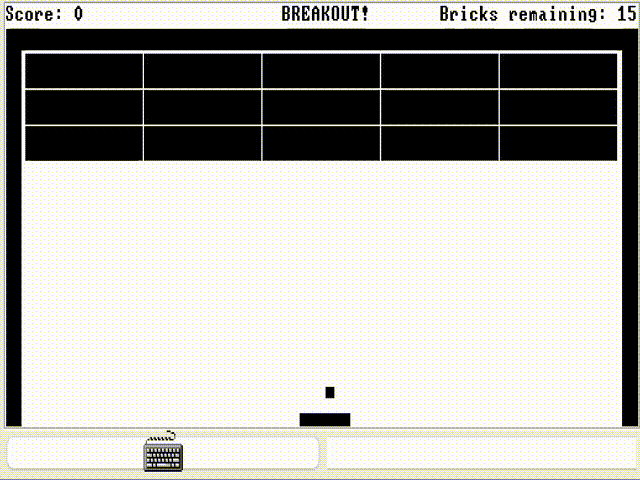
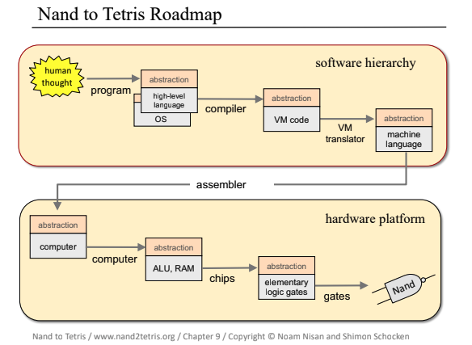

# Nand2Tetris: Building a Modern Computer from First Principles



My code for the renown [Nand2Tetris]((https://www.nand2tetris.org)) course, culminating in the Breakout game shown above, running on the computational stack designed and implemented in this repository.



The course goes through building a simple general purpose computer, from elementary switching gates (NAND gates) to high-level object-oriented software engineering, resulting in a hardware platform and software hierarchy capable of implementing arbitrary programs, such as Tetris (or in my case, [Breakout](https://en.wikipedia.org/wiki/Breakout_(video_game))). The aim is to provide hands-on knowledge of hardware, architecture, operating systems, programming languages, compilers, software engineering and relevant algorithms and data structures.

Check out the Nand2Tetris [website](https://www.nand2tetris.org) and accompanying textbook, [*The Elements of Computing Systems: Building a Modern Computer from First Principles*](https://www.amazon.co.uk/Elements-Computing-Systems-second-Principles-ebook/dp/B084V7R8PT/ref=tmm_kin_swatch_0) for more information.

## Usage

To play the Breakout game, you can run the VM Emulator provided as part of the [Nand2Tetris software package](https://www.nand2tetris.org/software) (I used the desktop version) and then select `Load Program` and load `09/Breakout` from this repository.

The arrow keys `←` and `→` can be used to change the direction of the paddle movement, and `↓` can be used to stop it. The goal is to break all 15 blocks without allowing the ball to go off the bottom of the screen.

Alternatively, if you want to use the full stack developed in this repository (i.e. the Jack program developed in Project 9, using the OS from Project 12, the Jack Compiler from Projects 10 and 11, the VM Translator from Projects 7 and 8, and the Assembler from Project 6, all running on the Hack hardware developed in Projects 1-5), you can run the following (assuming a minimal python installation):

```bash
git clone git@github.com:AdamJelley/Nand2Tetris.git
cd Nand2Tetris
# Compile the OS and Breakout Jack program into VM code (.vm files)
python ./11/JackAnalyzer/JackAnalyzer.py ./12/BreakoutCompleteTest
# Translate the VM code into Assembly code (.asm file)
python ./08/VMTranslator/VMTranslator.py ./12/BreakoutCompleteTest
# Translate the symbolic Assembly code into 16-bit binary code (.hack file)
python ./06/HackAssembler/main.py ./12/BreakoutCompleteTest
```
The resulting single `.hack` [file](12/BreakoutCompleteTest/BreakoutCompleteTest.hack) can then in theory* be run on the CPU Emulator which emulates on the combination of Nand gates from Projects 1-5!

*Unfortunately, the resulting `.hack` [file](12/BreakoutCompleteTest/BreakoutCompleteTest.hack) contains 61229 lines, which is too large for the provided CPU Emulator, which can only run programs up to 32676 lines. As an alternative, the `.vm` files can be run by loading the directory `12/BreakoutCompleteTest` into the VM Emulator.

## Course Syllabus:
### Part I: Hardware
- **Project 1: Boolean Logic**
    - Designing a set of 15 elementary logic gates from primative NAND gates using a simple Hardware Description Language (HDL).
- **Project 2: Boolean Arithmetic**
    - Combining the elementary logic gates designed in Project 1 into more complex chips, namely a simple Arithmetic Logic Unit (ALU), capable of performing arithmetic and logical operations. The ALU is later used as a core component of the computer's Central Processing Unit (CPU).
- **Project 3: Sequential Logic**
    - Building a hierarchy of memory chips, from elementary flip-flop gates into n-bit registers and eventually Random Access Memory (RAM) chips. Unlike processing chips which use combinatorial Boolean logic, these chips use clock-based sequential logic.
- **Project 4: Machine Language**
    - Writing low-level assembly programs in the Hack machine language, capable of multiplication and memory operations to develop an understanding of what will be required from the Hack computer.
- **Project 5: Computer Architecture**
    - Integrating the earlier ALU and memory chips into a general-purpose 16-bit computer called Hack. The ALU is combined with A, D and M registers and a program counter (PC) to form the Central Processing Unit (CPU), which is then combined with RAM (Random Access Memory) and ROM (Read-Only Memory) to form the Hack computer.
- **Project 6: Assembler**
    - Building the Assembler, which translates the symbolic machine language (assembly code) into binary code (a time-series of 16-bit input) which can be run directly on the Hack computer.
### Part II: Software
- **Project 7: VM I: Stack Arithmetic**
    - Building the first part of a Virtual Machine Translator to translate virtual machine language into assembly code. This first part implements the translation of stack arithmetic and memory access operations.
- **Project 8: VM II: Program Control**
    - Completion of the Virtual Machine Translator by including flow control and function call and return operations. This enables the use of a higher-level Virtual Machine (VM) abstraction based on a stack, similar to modern software implementations that use two-tier compilers, such as Java.
- **Project 9: High-Level Language**
    - Writing a program in Jack, a simple high-level object-oriented language with a Java-like syntax. I implemented the game [Breakout](https://en.wikipedia.org/wiki/Breakout_(video_game)). To run a Jack program on the Hack computer using the previous VM translator, it must be compiled into VM code. This is developed in the following projects.
- **Project 10: Compiler I: Syntax Analysis**
    - Building a syntax analyser to parse arbitray Jack programs. This uses a recursive algorithm to output an XML file that captures the semantic structure of the program.
- **Project 11: Compiler II: Code Generation**
    - Completing the Jack compiler to compile arbitrary Jack code into VM code that runs on the virtual machine developed in Projects 7 and 8.
- **Project 12: Operating System**
    - Implementation of the final component required to run Jack programs on the Hack computer; the Operating System. This comprises of eight classes written in Jack:
        - Sys: Handles system booting and program executation utilities.
        - Memory: Handles memory allocation and deallocation operations.
        - Math: Provides basic mathematical operations in an efficient manner.
        - Screen: Handles graphical screen output.
        - Output: Handles text-based output.
        - Keyboard: Handles user input from the keyboard.
        - String: Implements a String type and basic string processing operations.
        - Array: Implements the Array type and enables construction and disposal of arrays.

